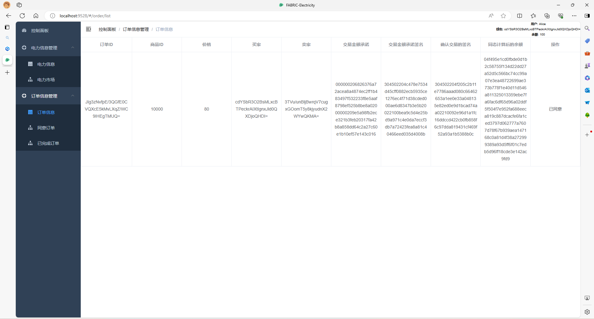
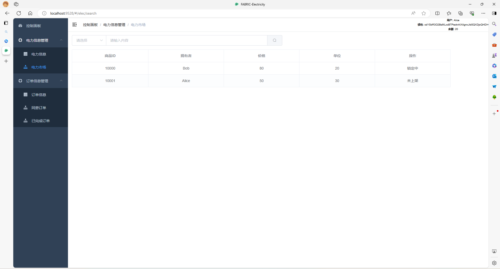
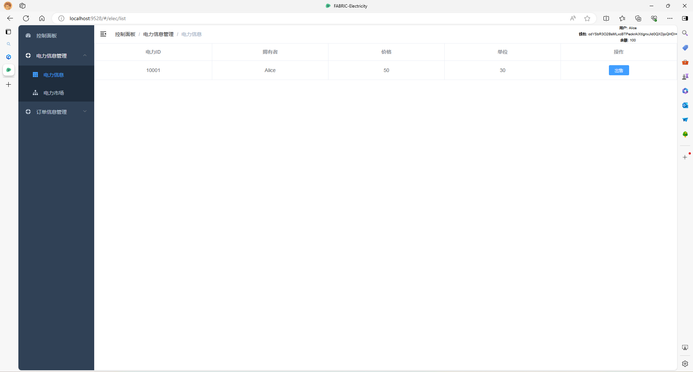
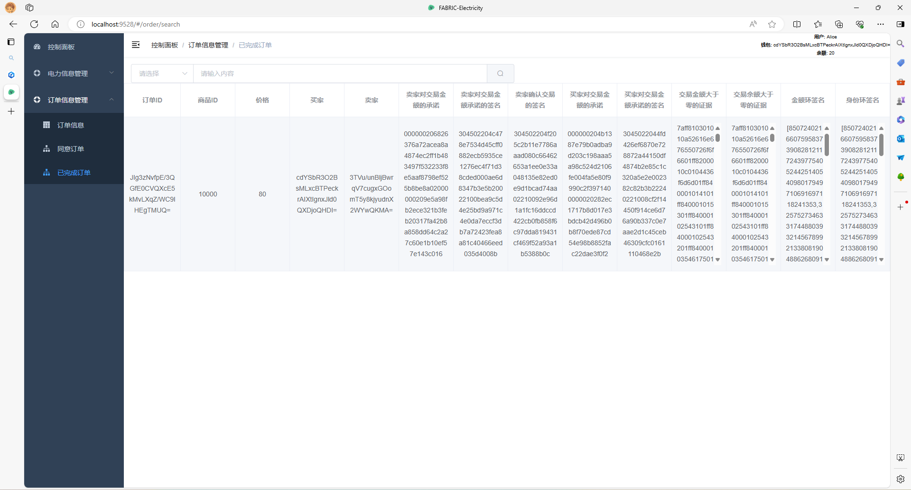

## FABRIC-Electricity
[TOC]
#### 零、基础
项目为前后分离项目  
1、前端(front-end)  
- 基于 vue-admin-template 开发      
- 根据github上的学生信息管理系统修改得到的一个网页，目前还没有修改完成后续会继续对项目进行补全。

2、后端(rear-end)    
- go-gin  
- Hyperledger-Fabric  

#### 一、系统预览
1、查看电力信息
<!--    -->
 

2、查看市场信息  
<!--    -->

3、查看订单信息
<!--    -->

4、查看交易信息  
<!--    -->

#### 二、源码获取   
https://github.com/MoonShinesSeas/fabric-electricity.git 

#### 四、运行代码  
- 前端  
1、git clone https://github.com/MoonShinesSeas/fabric-electricity.git 
2、cd application 
3、npm install  
4、npm run dev  
5、浏览器访问 http://localhost:9528  
