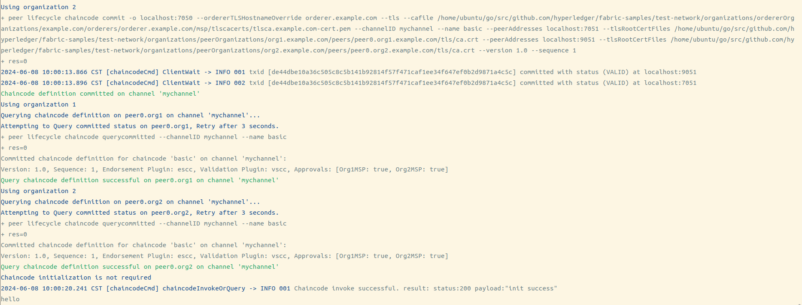

# fabric-electricity

> 这是区块链的智能合约

由于之前的修改导致项目出现一些难以理解的部分，以及逻辑上的错误，后续会对这个项目继续补全；

区块链可以用于供应链、金融等多个方面；

联盟链可以实现接入区块链的网络受到控制，不像公有链一样的公开，但是私有链内部也是一样的公开信息；

由于gin后端使用的是sm2环签名和对交易签名，而联盟链的注册是向CA申请一个证书，证书中包含用户的密钥，所以需要一个可以分发国密证书的CA，但是Fabric的国密改造项目运行的一言难尽，Fabric链码可以启动，但是Fabric-gm-sdk-go无法运行，在Vone-Chain项目下提交的issue也无疾而终，所以目前的解决办法就是将密钥先保存到本地，以待后续解决fabric-gm-go-sdk连接fabric的问题，再将功能转为CA上；但是普通的向CA注册在我的另一个项目Fabric-electricity-java中有实现，当时没有实现网页，只是实现了后端和链码；

## Build Setup

```bash
# 克隆Fabric-samples项目
git clone https://github.com/hyperledger/fabric-samples.git

cd fabric-samples

git checkout release-2.2

git branch

# 这一步将会出现很多问题，但是在ubuntu中下载一个Clash然后打开代理就能够下载，但是下载过程中突然卡住不动，建议Ctrl+c暂停，再重新开始，配置基础环境对新手很折磨
curl -sSL https://bit.ly/2ysbOFE | bash -s -- 2.2.0 1.4.7 0.4.18
# 克隆项目
git clone https://github.com/MoonShinesSeas/fabric-electricity.git

# 移动项目目录，将chaincode_go移动到fabric-samples/asset-transfer-basic下

# 安装依赖
go mod tidy
go mod vendor

#进入test-network文件夹
cd test-network

#运行项目,这个脚本需要从项目复制到test-network目录下,并赋予权限
sudo chmod -R +x ./start.sh
./start.sh
```
执行成功是这样的
<!--    -->


