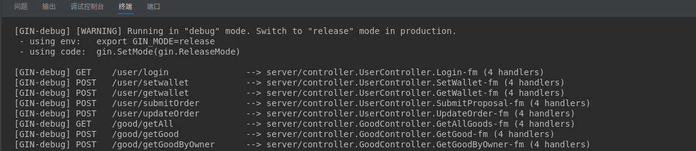

# fabric-electricity

> 这是一个 gin 后台。

## Build Setup

```bash
# 克隆项目
git clone https://github.com/MoonShinesSeas/fabric-electricity.git

# 进入项目目录
cd server

# 安装依赖
go mod tidy

# 启动服务
go run main.go
```
程序顺利执行的话，可以看到
<!--    -->


其中的sm2同态加密是基于
http://www.jcr.cacrnet.org.cn/CN/10.13868/j.cnki.jcr.000532
实现的，论文中使用了一种门限解密，我采用了简单的大小步算法解密，这种解密算法主要基于密钥的安全性了。


